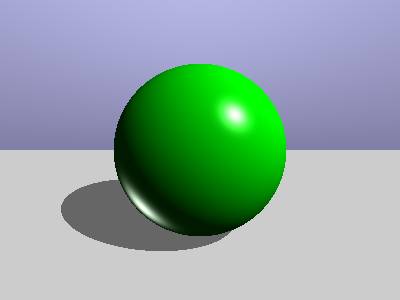

# Ray Tracer em Python

Este projeto é uma implementação básica de um ray tracer em Python que gera uma imagem de uma esfera iluminada usando o modelo de iluminação Phong. As configurações iniciais, como dimensões da imagem, parâmetros da câmera e propriedades de iluminação, são carregadas de um arquivo YAML.

## Dependências

- Python 3.x
- NumPy
- Pillow
- PyYAML

## Instalação

1. Clone o repositório:

    ```bash
    git clone https://github.com/seu-usuario/seu-repositorio.git
    cd seu-repositorio
    ```

2. Crie um ambiente virtual e instale as dependências:

    ```bash
    python3 -m venv venv
    source venv/bin/activate  # No Windows, use `venv\Scripts\activate`
    pip install -r requirements.txt
    ```

## Configuração

O arquivo `config.yaml` contém as configurações para a imagem, câmera, esfera, plano e iluminação. Um exemplo de `config.yaml` é fornecido abaixo:

```yaml
image:
  width: 400
  height: 300

camera:
  viewport_height: 2.0
  focal_length: 1.0

sphere:
  center: [0.0, 0.0, -1.0]
  radius: 0.5

plane:
  point: [0.0, -0.5, 0.0]
  normal: [0.0, 1.0, 0.0]

lighting:
  ambient_color: [0.1, 0.1, 0.1]
  object_color: [0.0, 1.0, 0.0] 
  specular_color: [1.0, 1.0, 1.0]
  light_position: [2.0, 2.0, 1.0]
  light_color: [1.0, 1.0, 1.0]
  shadow_intensity: 0.5
```

## Uso

1. Execute o script principal para gerar a imagem:

```bash
python ray_tracer.py
```
2. A imagem gerada (sphere.png) será salva no diretório atual.

## Estrutura do Código

- ray_tracer.py: Script principal que carrega as configurações, gera a imagem e a salva.
- config.yaml: Arquivo de configuração com os parâmetros da imagem, câmera, esfera, plano e iluminação.

## Funcionalidades
- Câmera: Configuração da câmera com parâmetros de comprimento focal e altura da viewport.
- Esfera: Desenho de uma esfera com centro e raio configuráveis.
- Plano: Desenho de um plano que serve como "chão" para a cena.
- Iluminação: Implementação do modelo de iluminação Phong com componentes ambiente, difusa e especular.
- Sombras: Cálculo de sombras baseadas na interseção dos raios com a esfera e o plano.

## Imagem


## Trabalho Computação Gráfica - Igor Godinho
